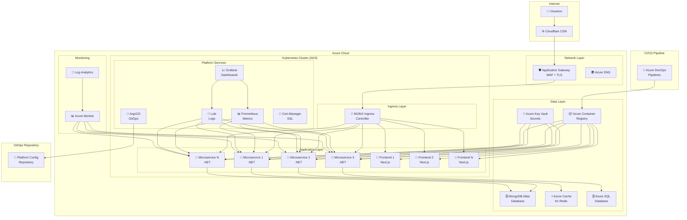
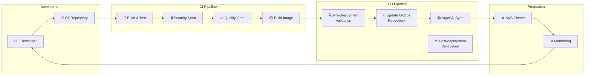
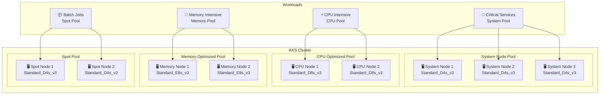
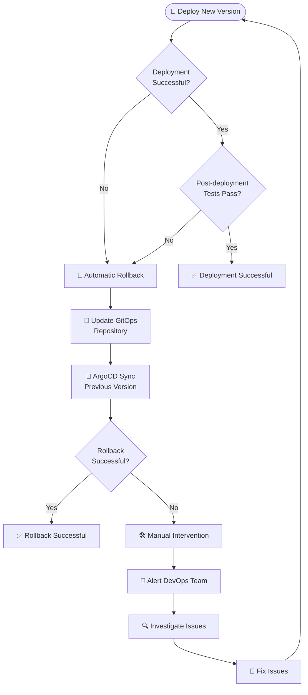
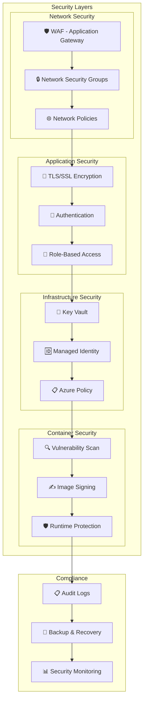
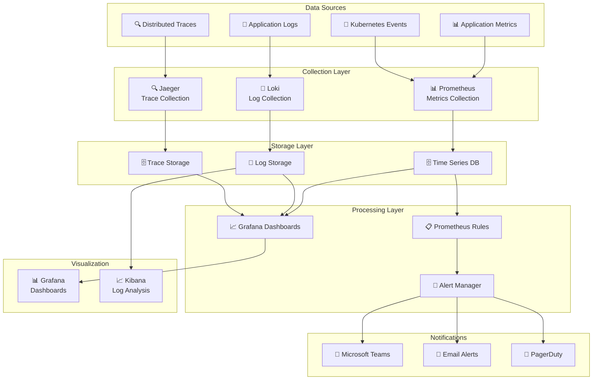

# Arquitectura de la Plataforma DevOps

## Diagrama General de Arquitectura

## Flujo de CI/CD

## Modelo de Nodos AKS

## Estrategia de Rollback

## Seguridad y Compliance

## Observabilidad

## Beneficios de la Arquitectura

### 🚀 **Escalabilidad**
- **Horizontal**: Auto-scaling basado en métricas
- **Vertical**: Múltiples pools de nodos optimizados
- **Geográfica**: CDN global con Cloudflare

### 🔒 **Seguridad**
- **Defensa en profundidad**: Múltiples capas de seguridad
- **Zero Trust**: Autenticación y autorización granular
- **Compliance**: Cumplimiento con estándares de seguridad

### 📊 **Observabilidad**
- **End-to-end**: Trazabilidad completa de requests
- **Real-time**: Monitoreo en tiempo real
- **Proactivo**: Alertas automáticas y auto-remediation

### 🔄 **GitOps**
- **Declarativo**: Estado deseado en Git
- **Auditable**: Historial completo de cambios
- **Automático**: Sincronización automática

### 💰 **Cost Optimization**
- **Spot Instances**: Para workloads no críticos
- **Auto-scaling**: Escalado automático basado en demanda
- **Resource Optimization**: Pools especializados por tipo de workload 