# Arquitectura de la Plataforma DevOps

## Diagrama General de Arquitectura

```mermaid
graph TB
    subgraph "Internet"
        Users[👥 Usuarios]
        CDN[🌐 Cloudflare CDN]
    end
    
    subgraph "Azure Cloud"
        subgraph "Network Layer"
            AGW[🛡️ Application Gateway<br/>WAF + TLS]
            DNS[🌍 Azure DNS]
        end
        
        subgraph "Kubernetes Cluster (AKS)"
            subgraph "Ingress Layer"
                NGINX[🔄 NGINX Ingress<br/>Controller]
            end
            
            subgraph "Application Layer"
                MS1[🔧 Microservice 1<br/>.NET]
                MS2[🔧 Microservice 2<br/>.NET]
                MS3[🔧 Microservice 3<br/>.NET]
                MSn[🔧 Microservice N<br/>.NET]
                FE1[🎨 Frontend 1<br/>Next.js]
                FE2[🎨 Frontend 2<br/>Next.js]
                FEn[🎨 Frontend N<br/>Next.js]
            end
            
            subgraph "Platform Services"
                ARGOCD[🚀 ArgoCD<br/>GitOps]
                PROM[📊 Prometheus<br/>Metrics]
                GRAF[📈 Grafana<br/>Dashboards]
                LOKI[📝 Loki<br/>Logs]
                CERT[🔐 Cert-Manager<br/>SSL]
            end
        end
        
        subgraph "Data Layer"
            ACR[📦 Azure Container<br/>Registry]
            KV[🔑 Azure Key Vault<br/>Secrets]
            MONGO[🗄️ MongoDB Atlas<br/>Database]
            REDIS[⚡ Azure Cache<br/>for Redis]
            SQL[🗄️ Azure SQL<br/>Database]
        end
        
        subgraph "Monitoring"
            AM[📊 Azure Monitor]
            LA[📝 Log Analytics]
        end
    end
    
    subgraph "GitOps Repository"
        CONFIG[📁 Platform Config<br/>Repository]
    end
    
    subgraph "CI/CD Pipeline"
        ADO[🔄 Azure DevOps<br/>Pipelines]
    end
    
    %% Connections
    Users --> CDN
    CDN --> AGW
    AGW --> NGINX
    NGINX --> MS1
    NGINX --> MS2
    NGINX --> MS3
    NGINX --> MSn
    NGINX --> FE1
    NGINX --> FE2
    NGINX --> FEn
    
    MS1 --> MONGO
    MS2 --> REDIS
    MS3 --> SQL
    MSn --> MONGO
    
    ARGOCD --> CONFIG
    ADO --> ACR
    ACR --> MS1
    ACR --> MS2
    ACR --> MS3
    ACR --> MSn
    ACR --> FE1
    ACR --> FE2
    ACR --> FEn
    
    KV --> MS1
    KV --> MS2
    KV --> MS3
    KV --> MSn
    
    PROM --> MS1
    PROM --> MS2
    PROM --> MS3
    PROM --> MSn
    GRAF --> PROM
    LOKI --> MS1
    LOKI --> MS2
    LOKI --> MS3
    LOKI --> MSn
    GRAF --> LOKI
    
    AM --> MS1
    AM --> MS2
    AM --> MS3
    AM --> MSn
    LA --> AM
```

## Flujo de CI/CD

```mermaid
graph LR
    subgraph "Development"
        DEV[👨‍💻 Developer]
        GIT[📁 Git Repository]
    end
    
    subgraph "CI Pipeline"
        BUILD[🔨 Build & Test]
        SECURITY[🔒 Security Scan]
        QUALITY[✅ Quality Gate]
        IMAGE[📦 Build Image]
    end
    
    subgraph "CD Pipeline"
        VALIDATE[🔍 Pre-deployment<br/>Validation]
        GITOPS[🚀 Update GitOps<br/>Repository]
        DEPLOY[📤 ArgoCD Sync]
        VERIFY[✅ Post-deployment<br/>Verification]
    end
    
    subgraph "Production"
        AKS[☸️ AKS Cluster]
        MONITOR[📊 Monitoring]
    end
    
    DEV --> GIT
    GIT --> BUILD
    BUILD --> SECURITY
    SECURITY --> QUALITY
    QUALITY --> IMAGE
    IMAGE --> VALIDATE
    VALIDATE --> GITOPS
    GITOPS --> DEPLOY
    DEPLOY --> AKS
    AKS --> MONITOR
    MONITOR --> DEV
```

## Modelo de Nodos AKS

```mermaid
graph TB
    subgraph "AKS Cluster"
        subgraph "System Node Pool"
            SN1[🖥️ System Node 1<br/>Standard_D4s_v3]
            SN2[🖥️ System Node 2<br/>Standard_D4s_v3]
            SN3[🖥️ System Node 3<br/>Standard_D4s_v3]
        end
        
        subgraph "CPU Optimized Pool"
            CPU1[🖥️ CPU Node 1<br/>Standard_D8s_v3]
            CPU2[🖥️ CPU Node 2<br/>Standard_D8s_v3]
        end
        
        subgraph "Memory Optimized Pool"
            MEM1[🖥️ Memory Node 1<br/>Standard_E8s_v3]
            MEM2[🖥️ Memory Node 2<br/>Standard_E8s_v3]
        end
        
        subgraph "Spot Pool"
            SPOT1[🖥️ Spot Node 1<br/>Standard_D4s_v3]
            SPOT2[🖥️ Spot Node 2<br/>Standard_D4s_v3]
        end
    end
    
    subgraph "Workloads"
        CRITICAL[🚨 Critical Services<br/>System Pool]
        CPU_INTENSIVE[⚡ CPU Intensive<br/>CPU Pool]
        MEMORY_INTENSIVE[🧠 Memory Intensive<br/>Memory Pool]
        BATCH[📦 Batch Jobs<br/>Spot Pool]
    end
    
    CRITICAL --> SN1
    CRITICAL --> SN2
    CRITICAL --> SN3
    CPU_INTENSIVE --> CPU1
    CPU_INTENSIVE --> CPU2
    MEMORY_INTENSIVE --> MEM1
    MEMORY_INTENSIVE --> MEM2
    BATCH --> SPOT1
    BATCH --> SPOT2
```

## Estrategia de Rollback

```mermaid
graph TD
    START([🚀 Deploy New Version]) --> DEPLOY{Deployment<br/>Successful?}
    
    DEPLOY -->|Yes| VERIFY{Post-deployment<br/>Tests Pass?}
    DEPLOY -->|No| ROLLBACK[🔄 Automatic Rollback]
    
    VERIFY -->|Yes| SUCCESS[✅ Deployment Successful]
    VERIFY -->|No| ROLLBACK
    
    ROLLBACK --> GITOPS[📝 Update GitOps<br/>Repository]
    GITOPS --> ARGOCD[🚀 ArgoCD Sync<br/>Previous Version]
    ARGOCD --> VERIFY_ROLLBACK{Rollback<br/>Successful?}
    
    VERIFY_ROLLBACK -->|Yes| ROLLBACK_SUCCESS[✅ Rollback Successful]
    VERIFY_ROLLBACK -->|No| MANUAL[🛠️ Manual Intervention]
    
    MANUAL --> ALERT[🚨 Alert DevOps Team]
    ALERT --> INVESTIGATE[🔍 Investigate Issues]
    INVESTIGATE --> FIX[🔧 Fix Issues]
    FIX --> START
```

## Seguridad y Compliance

```mermaid
graph TB
    subgraph "Security Layers"
        subgraph "Network Security"
            WAF[🛡️ WAF - Application Gateway]
            NSG[🔒 Network Security Groups]
            NP[🌐 Network Policies]
        end
        
        subgraph "Application Security"
            TLS[🔐 TLS/SSL Encryption]
            AUTH[🔑 Authentication]
            RBAC[👥 Role-Based Access]
        end
        
        subgraph "Infrastructure Security"
            KV[🔐 Key Vault]
            MSI[🆔 Managed Identity]
            POLICY[📋 Azure Policy]
        end
        
        subgraph "Container Security"
            SCAN[🔍 Vulnerability Scan]
            SIGN[✍️ Image Signing]
            RUNTIME[🛡️ Runtime Protection]
        end
    end
    
    subgraph "Compliance"
        AUDIT[📋 Audit Logs]
        BACKUP[💾 Backup & Recovery]
        MONITOR[📊 Security Monitoring]
    end
    
    WAF --> NSG
    NSG --> NP
    NP --> TLS
    TLS --> AUTH
    AUTH --> RBAC
    RBAC --> KV
    KV --> MSI
    MSI --> POLICY
    POLICY --> SCAN
    SCAN --> SIGN
    SIGN --> RUNTIME
    RUNTIME --> AUDIT
    AUDIT --> BACKUP
    BACKUP --> MONITOR
```

## Observabilidad

```mermaid
graph TB
    subgraph "Data Sources"
        METRICS[📊 Application Metrics]
        LOGS[📝 Application Logs]
        TRACES[🔍 Distributed Traces]
        EVENTS[📅 Kubernetes Events]
    end
    
    subgraph "Collection Layer"
        PROM[📊 Prometheus<br/>Metrics Collection]
        LOKI[📝 Loki<br/>Log Collection]
        JAEGER[🔍 Jaeger<br/>Trace Collection]
    end
    
    subgraph "Processing Layer"
        ALERT[🚨 Alert Manager]
        RULES[📋 Prometheus Rules]
        DASHBOARDS[📈 Grafana Dashboards]
    end
    
    subgraph "Storage Layer"
        TSDB[🗄️ Time Series DB]
        LOG_STORAGE[📁 Log Storage]
        TRACE_STORAGE[🗄️ Trace Storage]
    end
    
    subgraph "Visualization"
        GRAFANA[📊 Grafana<br/>Dashboards]
        KIBANA[📈 Kibana<br/>Log Analysis]
    end
    
    subgraph "Notifications"
        TEAMS[💬 Microsoft Teams]
        EMAIL[📧 Email Alerts]
        PAGERDUTY[📱 PagerDuty]
    end
    
    METRICS --> PROM
    LOGS --> LOKI
    TRACES --> JAEGER
    EVENTS --> PROM
    
    PROM --> TSDB
    LOKI --> LOG_STORAGE
    JAEGER --> TRACE_STORAGE
    
    TSDB --> RULES
    RULES --> ALERT
    ALERT --> TEAMS
    ALERT --> EMAIL
    ALERT --> PAGERDUTY
    
    TSDB --> DASHBOARDS
    LOG_STORAGE --> DASHBOARDS
    TRACE_STORAGE --> DASHBOARDS
    
    DASHBOARDS --> GRAFANA
    LOG_STORAGE --> KIBANA
```

## Beneficios de la Arquitectura

### 🚀 **Escalabilidad**
- **Horizontal**: Auto-scaling basado en métricas
- **Vertical**: Múltiples pools de nodos optimizados
- **Geográfica**: CDN global con Cloudflare

### 🔒 **Seguridad**
- **Defensa en profundidad**: Múltiples capas de seguridad
- **Zero Trust**: Autenticación y autorización granular
- **Compliance**: Cumplimiento con estándares de seguridad

### 📊 **Observabilidad**
- **End-to-end**: Trazabilidad completa de requests
- **Real-time**: Monitoreo en tiempo real
- **Proactivo**: Alertas automáticas y auto-remediation

### 🔄 **GitOps**
- **Declarativo**: Estado deseado en Git
- **Auditable**: Historial completo de cambios
- **Automático**: Sincronización automática

### 💰 **Cost Optimization**
- **Spot Instances**: Para workloads no críticos
- **Auto-scaling**: Escalado automático basado en demanda
- **Resource Optimization**: Pools especializados por tipo de workload 